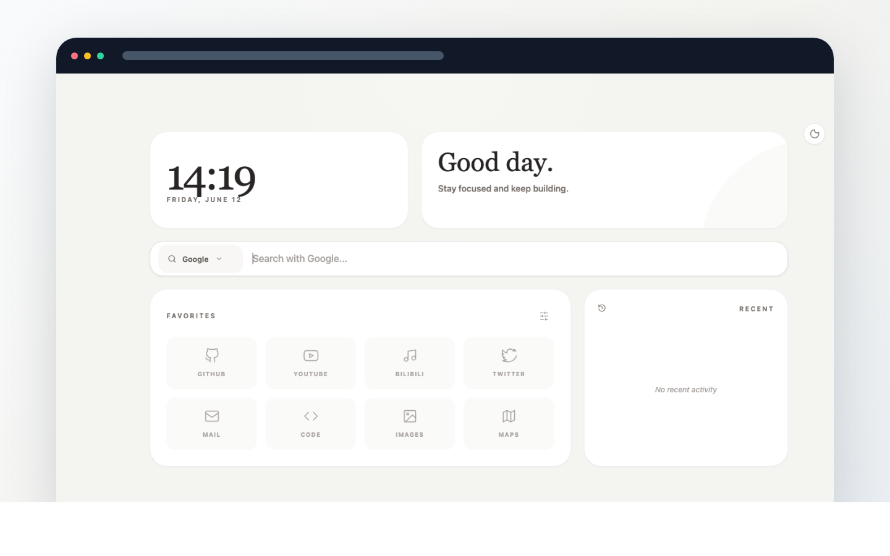

# DI-Viewer

DI-Viewer 是一个桌面悬浮浏览器。它适合把视频、直播、文档、网页工具或仪表盘放在屏幕边上，并通过侧边控制条完成置顶、透明度、收藏、媒体控制和快速隐藏。

它不是完整浏览器的替代品，而是一个更轻的桌面网页容器：当你需要一个网页一直在旁边，但又不想频繁切回主浏览器时使用。



## 下载

从 GitHub Releases 下载最新版本：

[下载最新版 DI-Viewer](https://github.com/yyin9116/DI-Viewer/releases/latest)

当前发布产物：

- Windows x64：`.exe` 安装包、`.msi` 安装包
- macOS Apple Silicon：`.dmg`

## 你可以用它做什么

- 把课程、直播、会议回放或视频网页置顶到桌面边缘
- 常驻打开翻译、文档、监控面板、内部工具等网页
- 在网页旁边写代码、做笔记或处理其他任务
- 用较小窗口浏览网页，并随时调整透明度或隐藏
- 在外部网页中保留 DI-Viewer 的左侧控制条

## 主要功能

- 本地起始页：搜索、快捷入口、最近访问、夜间模式
- 多标签：在一个桌面容器内打开和切换多个网页
- 悬浮窗口：置顶、透明度、显示/隐藏、窗口尺寸控制
- 左侧控制条：收藏、媒体控制、全屏、设置、折叠
- 媒体辅助：播放/暂停、快进、快退、请求全屏
- 主题同步：起始页和控制台跟随明暗模式
- 状态保存：书签、标签和部分偏好会在重启后保留


## 快速开始

1. 下载适合你系统的安装包。
2. 安装并启动 DI-Viewer。
3. 在起始页输入网址或搜索关键词。
4. 打开网页后，使用左侧控制条进行收藏、媒体控制、全屏和设置调整。

常用操作：

- 折叠左侧控制条：减少对网页内容的遮挡
- 切换夜间模式：起始页和控制台会同步变更
- 调整透明度：让网页辅助信息更不打扰当前工作
- 添加收藏：把常用网页固定到起始页

## 常见问题

### 某些网站提示浏览器版本过低

DI-Viewer 使用系统 WebView，网站兼容性取决于系统 WebView、站点检测逻辑和当前 UA 策略。项目会持续改善常见站点兼容性，但不能保证所有网站都表现得和主流浏览器完全一致。

### 控制条挡住网页内容

可以折叠左侧控制条，或调整窗口尺寸。部分网页自己的浮层、播放器控制条可能仍会和 DI-Viewer 控制条发生视觉冲突。

### Release 里应该下载哪个文件

Windows 用户优先下载 `.exe` 安装包；如果你的环境更习惯企业部署或系统安装器，可以使用 `.msi`。Apple Silicon Mac 用户下载 `.dmg`。

## 隐私与权限

DI-Viewer 会加载你主动打开的网页。网页自身的网络请求、登录状态和第三方内容由对应网站控制。

应用侧会保存用于恢复体验的数据，例如书签、标签、起始页设置和部分窗口偏好。请不要把 DI-Viewer 当作安全隔离浏览器使用，也不要在不信任的网页中输入敏感信息。

## 开发者入口

如果你只是使用 DI-Viewer，下载 Releases 即可。

仓库结构：

- `tauri-di-viewer/`：当前主要桌面应用
- `shared/`：浏览器控制台共享前端
- `pyside-di-viewer/`：早期 PySide 实现
- `docs/releases/`：版本更新日志

本地运行 Tauri 版本：

```bash
cd shared
npm ci
npm run build

cd ../tauri-di-viewer
npm ci
npm run tauri:dev:auto-port
```

本地验证常用命令：

```bash
cd shared
npm run build

cd ../tauri-di-viewer/src-tauri
cargo check
```

打包桌面版本：

```bash
cd tauri-di-viewer
npm ci
npm run tauri build
```

发布版本通过 `v*` tag 触发 GitHub Actions，Release note 位于 `docs/releases/<tag>.md`。

## 许可证

当前仓库未声明开源许可证。未经作者明确许可，请不要将代码用于再分发或商业用途。
